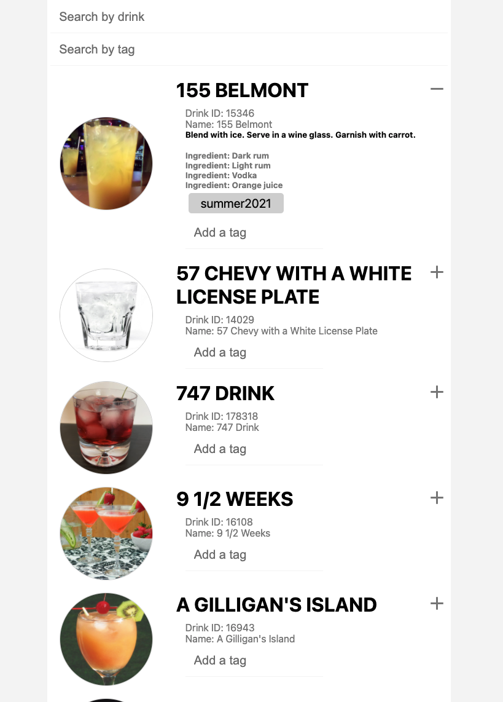

# ReactDrinks

## Project Overview

This projects explore React and search in a database fetch from an API.

## Preview

## Docker Build

> cd web

> docker build -t pob944/drinks .

> docker push pob944/drinks

## Dockert Generic command

> docker ps --all

> docker images

> docker logs "id from docker ps"

> docker run "id from docker ps"

### Local live testing
> docker run -p 3000:3000 pob944/drinks